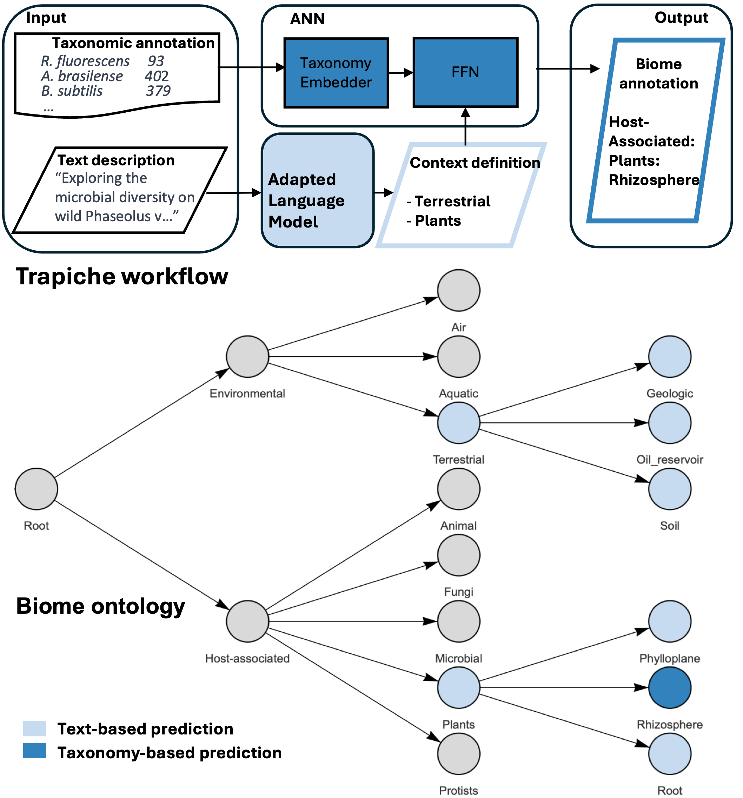

<p align="left">
  
</p>

Trapiche — Multi-source biome classification from text and taxonomy
===========================================================

Trapiche is an open-source tool for biome classification in metagenomic studies. The primary interface is **external text predictions**: you supply pre-computed biome labels (from manual curation, an external LLM, or any other source) directly in the input, and Trapiche uses them as constraints to guide its taxonomy-based deep classifier. A built-in BERT classifier is available as a lightweight fallback when no external labels are provided.

Trapiche combines two complementary sources of information:

- **Text-based** (primary): pre-computed biome labels supplied via `ext_text_pred_project` / `ext_text_pred_sample`, or — as a fallback — the built-in LLM-based classifier operating on free-text project/sample descriptions.
- **Taxonomy-based**: a community-embedding of taxonomic profiles is fed to a feed-forward model for deep biome lineage prediction.

By integrating both views, Trapiche improves accuracy and robustness in biome classification.



## Install

Requirements
- Python 3.10+
- Linux/macOS recommended (CPU or CUDA GPU)

From source
1) Clone this repository
2) Install the package and dependencies

By default TensorFlow is optional. Choose the extra that matches your needs:

```bash
# Clone
git clone https://github.com/Finn-Lab/trapiche.git
cd trapiche

# Install without TensorFlow (default)
pip install .

# Install with CPU-only TensorFlow
pip install .[cpu]

# Install with GPU TensorFlow
pip install .[gpu]
```

## Quick start (CLI)

The CLI expects NDJSON (one JSON object per line). Each object represents one sample.

Required/optional keys per sample:

**Text predictions (primary — recommended)**
- `ext_text_pred_project` (optional): list of biome labels for the project, from manual curation or an external LLM (e.g. `["root:Environmental:Aquatic:Marine"]`). If this key is present in **any** sample in the batch, the internal BERT classifier is skipped for the **entire batch**.
- `ext_text_pred_sample` (optional): list of biome labels for this specific sample. Used together with `ext_text_pred_project` when the sample-over-study heuristic is enabled.

**Text predictions (fallback — internal BERT classifier)**
- `project_description_text` (optional): free text describing the sample/project. Used only when no external labels are present.
- `project_description_file_path` (optional): path to a text file with the description. Ignored when `project_description_text` is provided.
- `sample_description_text` (optional): additional text for the specific sample. Used when the sample-over-study heuristic is enabled.

**Taxonomy predictions**
- `sample_taxonomy_paths` (required for taxonomy predictions): list of file paths.
	- Accepted formats: .tsv, .tsv.gz (non-recursive).

Optional identifiers and study-level input
- `project_id` (optional): identifier to group samples into a project/study.
- `sample_id` (optional): identifier of the sample within the study.
- `taxonomy_study_tsv` (optional): path to a study-level taxonomy summary TSV.
	- When provided, this is used instead of `sample_taxonomy_paths`.
	- Requires both `project_id` and `sample_id` to be present.
	- The TSV file is loaded once per unique path and cached for reuse.
	- Rows are looked up by `sample_id` when deriving per-sample taxonomy data.

Example input using external labels (recommended):

```json
{"ext_text_pred_project": ["root:Environmental:Aquatic:Marine"], "sample_taxonomy_paths": ["test/files/taxonomy_files/ERZ34590789/ERZ34590789_FASTA_diamond.tsv.gz"]}
{"ext_text_pred_project": ["root:Environmental:Terrestrial:Soil"], "ext_text_pred_sample": ["root:Environmental:Terrestrial:Soil:Agricultural"], "sample_taxonomy_paths": ["test/files/taxonomy_files/ERZ19590789_FASTA_diamond.tsv.gz"]}
```

Example input using the fallback internal classifier:

```json
{"project_description_text":"Effect of different fertilization treatments on soil microbiome...", "sample_taxonomy_paths":["test/files/taxonomy_files/ERZ34590789/ERZ34590789_FASTA_diamond.tsv.gz","test/files/taxonomy_files/ERZ34590789/ERZ34590789_FASTA_mseq.tsv"]}
{"project_description_file_path":"test/files/text_files/PRJEB42572_project_description.txt","sample_taxonomy_paths":["test/files/taxonomy_files/ERZ19590789_FASTA_diamond.tsv.gz"]}
```

Run the workflow

```bash
# From file to default output path (<input>_trapiche_results.ndjson)
# By default the CLI writes a compact (minimal) result. To disable the
# minimal output and let the workflow params control which
# keys are saved, use the --disable-minimal-result flag.
trapiche input.ndjson

# To explicitly disable the minimal output and keep the full set controlled
# by TrapicheWorkflowParams:
trapiche input.ndjson --disable-minimal-result

# Or read from stdin and write to stdout
cat input.ndjson | trapiche -

# Disable a step
trapiche input.ndjson --no-run-text  # no text-based constraints

# Enable/disable the sample-over-study heuristic for text predictions
trapiche input.ndjson --sample-study-text-heuristic
trapiche input.ndjson --no-sample-study-text-heuristic
```

Flags
- `--run-text/--no-run-text`, `--run-vectorise/--no-run-vectorise`, `--run-taxonomy/--no-run-taxonomy`
- `--keep-text-results / --keep-vectorise-results / --keep-taxonomy-results`
- `--disable-minimal-result` (default: false). When set, the default minimal output is disabled and
	the final keys saved are controlled by `TrapicheWorkflowParams`. By default the CLI produces the compact/minimal
	output (no flag required).
- `--sample-study-text-heuristic` (or `--no-sample-study-text-heuristic`): when both project/sample text labels are present (either external or internal), run prediction on both and keep the union of labels.

## Configuration via environment variables

Trapiche CLI and API use Pydantic Settings. You can override defaults with environment variables:

- `TRAPICHE_RUN_TEXT=true|false`
- `TRAPICHE_RUN_VECTORISE=true|false`
- `TRAPICHE_RUN_TAXONOMY=true|false`
- `TRAPICHE_SAMPLE_STUDY_TEXT_HEURISTIC=true|false`

Example:

```bash
export TRAPICHE_RUN_TEXT=false
export TRAPICHE_RUN_TAXONOMY=true
trapiche input.ndjson
```


## Quick start (Python API)


End-to-end workflow over sample records

Uses a sequence of dicts (one dict is one sample). The recommended approach is to supply external labels via `ext_text_pred_project`; the built-in classifier is used automatically as a fallback when those keys are absent.

**Text predictions (primary — recommended)**
- `ext_text_pred_project` (optional): list of biome labels for the project.
- `ext_text_pred_sample` (optional): list of biome labels for this specific sample. Used with the heuristic.

**Text predictions (fallback — internal BERT classifier)**
- `project_description_text` (optional): free text describing the sample/project.
- `project_description_file_path` (optional): path to a text file with the description.
- `sample_description_text` (optional): additional text for the specific sample (heuristic only).

**Taxonomy predictions**
- `sample_taxonomy_paths` (required for taxonomy predictions): list of file paths.
	- Accepted formats: .tsv, .tsv.gz (non-recursive).

```python
from trapiche.api import TrapicheWorkflowFromSequence
from trapiche.config import TrapicheWorkflowParams

# Recommended: supply external labels — no model download needed for the text step
samples = [
	{
		"ext_text_pred_project": ["root:Environmental:Aquatic:Marine"],
		"sample_taxonomy_paths": [
			"test/taxonomy_files/SRR1524511_MERGED_FASTQ_SSU_OTU.tsv",
			"test/taxonomy_files/SRR1524511_MERGED_FASTQ_LSU_OTU.tsv"
		]
	}
]

workflow_params = TrapicheWorkflowParams(  # defaults shown
	run_text=True, run_vectorise=True, run_taxonomy=True,
	keep_text_results=True, keep_vectorise_results=False, keep_taxonomy_results=True, output_keys=None
	# When output_keys is None, the keep_* flags decide what to include.
)

runner = TrapicheWorkflowFromSequence(workflow_params=workflow_params)
result = runner.run(samples)  # sequence of dicts augmented with predictions
print(result)
runner.save("trapiche_results.ndjson")  # optional convenience save
```

Fallback: internal text prediction from free text

```python
from trapiche.api import TextToBiome

ttb = TextToBiome()  # uses default model and device

texts = [x["project_description_text"] for x in samples]
text_predictions = ttb.predict(texts)
print(text_predictions)  # list[list[str]]: predicted biome labels per input text

# Optionally save last predictions
ttb.save("text_preds.json")
```

Taxonomy → community vector → biome lineage

```python
from trapiche.api import Community2vec, TaxonomyToBiome

# Vectorise one or more samples from taxonomy annotation files
c2v = Community2vec()

vectors = c2v.transform(samples)

tax2b = TaxonomyToBiome()
result = tax2b.predict(community_vectors=vectors,constrain=text_predictions)
print(len(result))
print(result[0])  # pandas DataFrame with per-sample predictions

# Optional saves
c2v.save("community_vectors.npy")
tax2b.save("taxonomy_predictions.csv")
tax2b.save_vectors("taxonomy_vectors.npy")
```

## Input schema

Input record (API and CLI workflow)

One JSON object per sample in either NDJSON (CLI) or List (API), with the following keys:

```json
{
	"ext_text_pred_project": ["root:Environmental:Aquatic:Marine"],
	"ext_text_pred_sample":  ["root:Environmental:Aquatic:Marine:Coastal"],
	// ^ primary text source: external labels (list of strings, each matching
	//   'root:Category[:Subcategory...]'). If present in any sample in the batch,
	//   the internal BERT classifier is skipped for the entire batch.

	"project_description_text": "Free text describing the sample.",
	"sample_description_text": "Free text describing this specific sample variant.",
	// ^ fallback — internal BERT classifier (used only when ext_text_pred_* are absent)
	// alternatively (if no inline text):
	// "project_description_file_path": "path/to/description.txt"

	"sample_taxonomy_paths": ["/path/to/sample1.tsv", "/path/to/sample1_b.tsv.gz"],

	// optional project/sample identifiers
	"project_id": "PRJEB12345",
	"sample_id": "SAMEA0000001",
	// optional study-level taxonomy summary (used instead of sample_taxonomy_paths)
	// requires project_id and sample_id; TSV is cached and looked up by sample_id
	// "taxonomy_study_tsv": "/path/to/study_taxonomy_summary.tsv"
}
```

**Label format**: every string in `ext_text_pred_project` / `ext_text_pred_sample` must match the pattern `root:Category[:Subcategory...]` (e.g. `"root:Environmental:Aquatic:Marine"`). An invalid label raises a `ValueError` immediately.

## Output schema
Output record (API and CLI workflow)
One JSON object per sample in either NDJSON (CLI) or List (API), with the following keys added to the input record:
```
 {'raw_unambiguous_prediction': ('root:Host-associated:Animal:Vertebrates:Mammals:Human:Skin',
   1.0),
  'raw_refined_prediction': {'root:Host-associated:Animal:Vertebrates:Mammals:Human:Skin': 1.0},
  'final_selected_prediction': {'root:Engineered:Food production': 1.0},
  'text_predictions': ['root:Engineered:Food production'],
  'constrained_unambiguous_prediction': ('root:Engineered:Food production',
   1.0),
  'constrained_refined_prediction': {'root:Engineered:Food production': 1.0}}
```

Best prediction is in `final_selected_prediction`.

## Project-level analysis (study summary)

Trapiche can produce a study-level summary in addition to per-sample outputs.
After running the workflow via the API, access `runner.study_summary` on the
`TrapicheWorkflowFromSequence` instance. The summary groups samples by
`project_id` and partitions predictions into confident vs low-confidence based on
`TrapicheWorkflowParams.study_summary_confidence_threshold` (default: 0.5):

```
{
	"<project_id>": {
		"confident": {"<biome>": ["<sample_id>", ...], ...},
		"low_confidence": {"<biome>": ["<sample_id>", ...], ...}
	},
	...
}
```

Notes
- Summary uses the `final_selected_prediction` per sample when available.
- Samples missing `project_id`/`sample_id` are ignored in the summary.
- When `taxonomy_study_tsv` is provided, Trapiche loads the TSV once per path
	and looks up rows using `sample_id`. Parsing into vectors may be extended in
	future versions; current support validates inputs and preserves workflow
	alignment.

## Sample-over-study heuristic (optional)

When enabled (via CLI flag `--sample-study-text-heuristic` or programmatically by setting `sample_study_text_heuristic=True` in `TrapicheWorkflowParams`), Trapiche will:

- Run prediction on both project-level and sample-level labels when both are provided.
- Compute a constrained union of the two label sets.

This heuristic works with **both** the external label pathway (`ext_text_pred_project` + `ext_text_pred_sample`) and the internal BERT classifier (`project_description_text` + `sample_description_text`), and can improve specificity when sample-level labels refine the broader project description.


## LLM-assisted text prediction (helper)

When you do not already have `ext_text_pred_*` labels, the
`trapiche.helpers.llm_text_pred` module can generate them by sending your
project/sample descriptions to any LiteLLM-supported provider (OpenAI,
Anthropic, Ollama, etc.) and parsing the structured GOLD ecosystem paths from
the response.

**Install**

```bash
pip install .[helpers]
```

**Usage**

```python
from trapiche.helpers.llm_text_pred import (
    from_workflow_samples,
    predict_biomes_from_text,
    to_trapiche_samples,
)
from trapiche.api import TrapicheWorkflowFromSequence

# Canonical workflow input — one dict per sample (e.g. loaded from NDJSON)
workflow_rows = [
    {
        "project_id": "PRJEB123",
        "project_description_text": "Soil metagenome from an agricultural field.",
        "sample_id": "S1",
        "sample_description_text": "Sandy loam topsoil.",
        "sample_taxonomy_paths": ["path/to/S1_diamond.tsv.gz"],
    },
    {
        "project_id": "PRJEB123",
        "project_description_text": "Soil metagenome from an agricultural field.",
        "sample_id": "S2",
        "sample_description_text": "Clay subsoil at 30 cm depth.",
        "sample_taxonomy_paths": ["path/to/S2_diamond.tsv.gz"],
    },
]

# 0. Reshape to project-grouped format
projects = from_workflow_samples(workflow_rows)

# 1. Predict biome labels via LLM
enriched = predict_biomes_from_text(
    projects,
    model="gpt-5.4",          # any litellm model string
    # litellm_kwargs={"temperature": 0},
)

# 2. Merge predictions back into original workflow rows
samples = to_trapiche_samples(enriched, base_samples=workflow_rows)
# Each dict now has ext_text_pred_project / ext_text_pred_sample

# 3. Run workflow — external text path is used automatically
runner = TrapicheWorkflowFromSequence()
results = runner.run(samples)
```

`predict_biomes_from_text` uses the bundled GOLD ecosystem taxonomy and prompt
template to guide the LLM, then validates every returned label against the
`root:Category:...` format before passing it back.

## Tests

Integration tests of API and CLI

Run tests:

```bash
python -m unittest discover -s test -p 'test_*.py' -q
```

## Data and models

Trapiche ships code only. Models used live in HugginFaceHub, and are downloaded by HF api.
